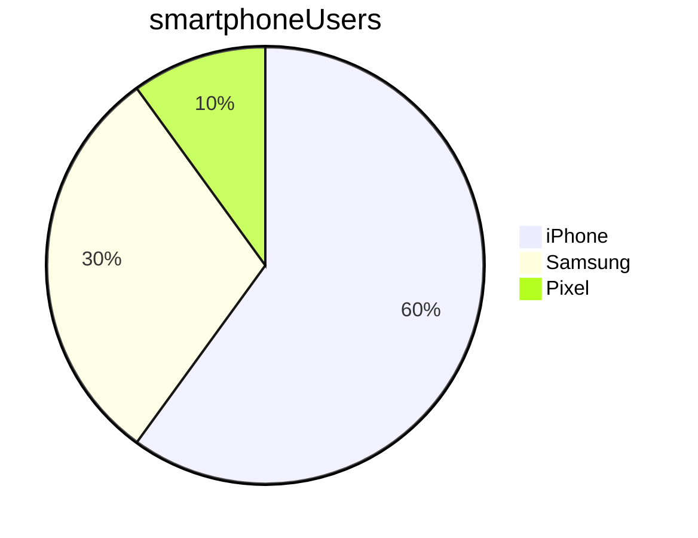

#markdown
# This is a h1 header  
  
## This is a h2 header  
  
### This is a h3 header  
  
This is plain text  
  
_This is italic text_  
  
*This is also italic text*  
  
* This is now a bullet point  
* - This is also a way of making a bullet point  
- These are separate lists  
  - This is a sublist  
    - A sublist of a sublist  
  
_ This is just an underscore  
  
**This is bold**  
  
__This is also bold__  
  
_**This is both italics and bold**_  
  
> This is a quote  
>> Quote within a quote  
  
1. This is a numbered list  
2. A second item in your numbered list  
   3. A numbered sublist  
4. Third item on your list even if my number is wrong  
  
- [ ] Have you completed this list?  
- [x] This item is completed  
  
  
[This is a link to a website](www.spartaglobal.com)  
  
  
  
Code line    
`This is a single line of code`  `print("hello")`  
  
Code block  
```python  
print("hello")  
```  
  
Horizontal line below  
  
---  
  
Line    
  
Break  
  
  
| Heading | Context |  
|---------|---------|  
| Item    | Stuff   |  

  

  
Forgotten line extra
